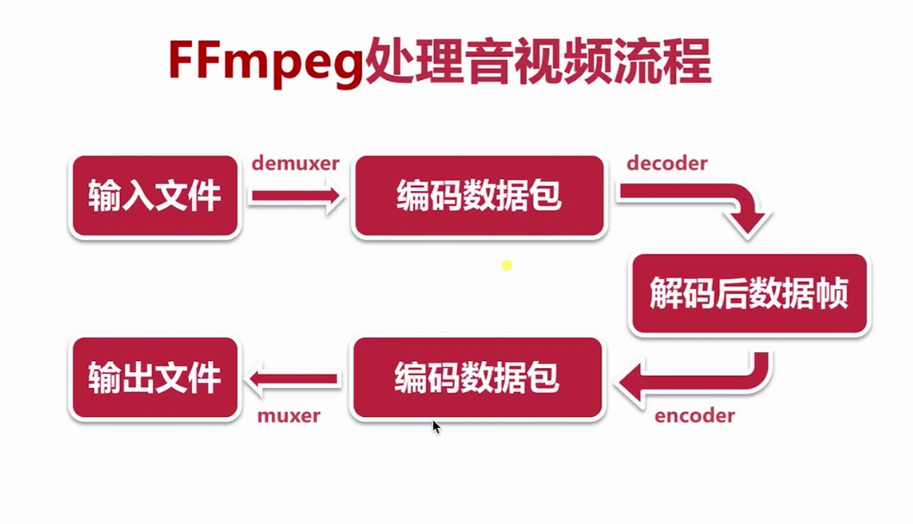

## FFMPEG

+ 是一个非常优秀的多媒体框架
+ 可以运行在Linux，Mac,Window等平台上
+ 能够编解码，转码，复用，解复用，过滤音视频数据

### 1.FFmpeg命令分类

| 基本信息查询命令 | 裁剪与合并命令    |
| ---------------- | ----------------- |
| 录制命令         | 图片/视频互转命令 |
| 分解/复用命令    | 直播相关命令      |
| 处理原始数据命令 | 各种滤镜命名      |

+ 直播推流

  ffmpeg -re -i out.mp4 -c copy -f flv  rtmp地址 

  | -c   | 音视频编解码   |
  | ---- | -------------- |
  | copy | 音视频参数不变 |
  | -f   | 文件格式       |
  | -re  | 帧率同步       |

+ 直播拉流

  ffmpeg -i rtmp地址  -c copy dump.flv

### 2.ffmpeg 处理流程

### 作用

### 3.ffnpeg 基本信息查询命令

| -version  | 显示版本         | -format    | 显示可用格式       |
| --------- | ---------------- | ---------- | ------------------ |
| -demuxers | 显示可用demuxers | -protocols | 显示可用的协议     |
| -muxers   | 显示可用的muxers | -filters   | 显示可用过滤器     |
| -devices  | 显示可用的设备   | -pix_fmts  | 显示可用的像素格式 |
| -codecs   | 显示所有编解码器 | -samp_fmts | 显示可用的采样格式 |
| -decoders | 显示可用的解码器 | -layouts   | 显示channel 名称   |
| -encoders | 显示所有的编码器 | -colors    | 显示识别的颜色名称 |
| -bsfs     | 显示比特流filter |            |                    |