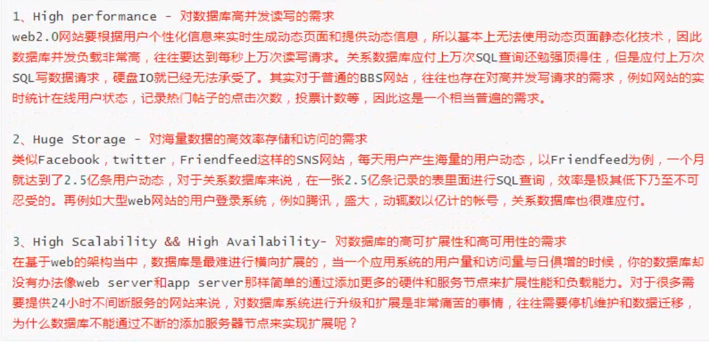

## Redis

### 1.0Redis 简介

### 什么是Redis

Redis 是完全开源免费的，遵守**BSD**协议，是一个高性能（NOSQL）的key-value 数据库，Redis 是一个开源的使用ANSI C语言编写，支持网络、可给予内存亦可持久化的日志※、key-value数据库，并提供多种语言的API。

> BSD是”Berkeley Software Distribution“的 缩写 ，意思是”伯克利软件发行版“、
>
> BSD开源协议是一个给与使用者很大自由的协议，可以自由的使用，修改源代码，也可以将修改后的diamante作为开源后者专有软件再发布，BSD鼓励代码共享，但需要尊重代码作者的著作权。
>
> BSD 由于允许使用者修改和重新发布代码，也允许使用或在BSD代码上及开发商业软件发布和销售，因此是对商业集成很友好的协议。

### 应用场景

>1、缓存
>
>2、排行榜
>
>3、计数器
>
>4、分布式会话
>
>5、分布式锁
>
>6、社交网络
>
>7、最新列表
>
>8、消息系统
>
>

## 1.1 NoSQL

> NoSQL,反制非关系型的数据库，NoSQL即Not-Only SQL ,它可以不作为关系型数据库的良好补充。
>
> NoSQL 的产生是为了解决大规模数据集合多重数据种类带来的挑战，尤其是大数据应用难题。

### 1.2 优劣势

#### 1.2.1 优势

+ 性能极高
+ 数据类型丰富
+ 原子性
+ 丰富的特性
+ 读写高速

#### 1.2.2 劣势

+ 持久性：Redis直接将数据存储到内存中，要将数据保存到磁盘上，Redis可以使用两种方式实现持久化过程。定时快照（snapshot）：每隔一段时间将整个数据库写到磁盘上，每次均是写全部数据，代价高，第二种方式给予语句追加（aof） ：只追踪变化的数据，但是最佳的log可能过大，同时所以的操作均重新执行一遍，回复速度慢。
+ 耗内存：占用内存过高。

